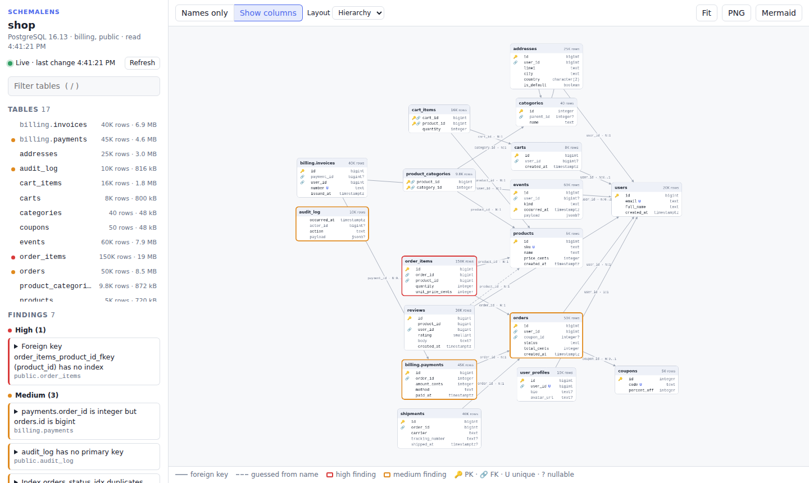
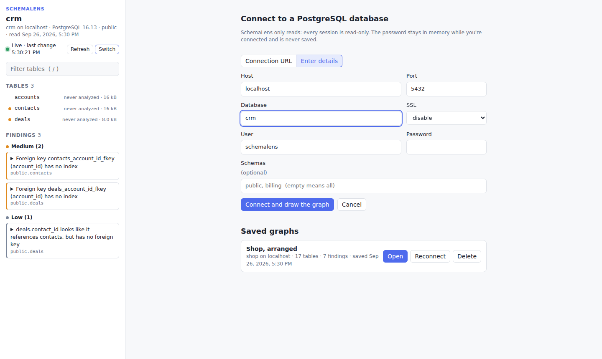
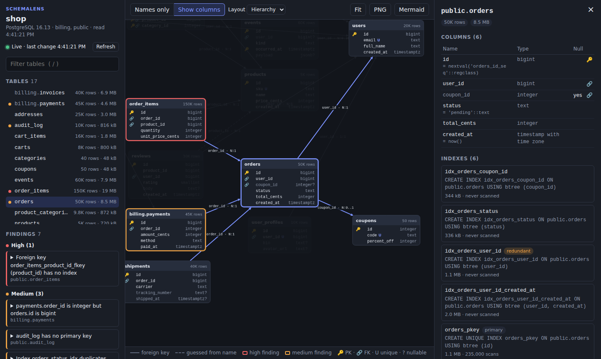
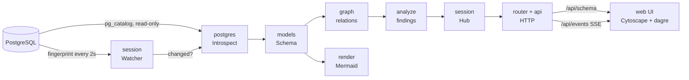

# SchemaLens

**See your PostgreSQL schema as a live relationship graph, with the
structural problems that will slow it down.**

When you write SQL you usually can't tell what it will cost: whether it
scans a whole table or quietly pushes CPU up. Tools like pganalyze, Datadog
and PMM tell you *after* the slow query reaches production. SchemaLens aims to
tell you **while you are writing it**. The first step, and what this
repository does today, is to understand the database: which tables exist, how
big they are, how they relate, and what's structurally wrong. It's shown as
an interactive graph that follows the database as you migrate it.



- **Live.** Run a migration and the graph updates within seconds. New tables
  appear next to the tables they reference, and nothing else moves.
- **Read-only by design.** Every session runs with
  `default_transaction_read_only = on` and a statement timeout. Suggested fixes
  are text for you to copy; SchemaLens never runs them.
- **Connect from the page.** Paste a connection URL or type host, user and
  password, and the graph is drawn. Switch databases without restarting.
- **Saved graphs.** Save a graph with its layout and open it again later,
  without the database. The password is never saved.
- **No CDN.** The page's libraries are checked in, so it works offline.

## Quickstart

You need Go 1.25+, Node 22+ and a PostgreSQL database to look at.

```sh
git clone https://github.com/sanat-19/schema-lens
cd schema-lens
make run
```

`make run` starts the backend (the API, on 127.0.0.1:8080) and the frontend
(the page, on http://localhost:5173), and opens the Connect page in your
browser. Ctrl+C stops both. Enter
your database's details and the graph is drawn. Keep the page open while
you change the schema and it updates live. **Exit**, at the top of the left
panel, closes the graph and takes you back to the Connect page.

## Connect from the browser

Start the backend with `go run ./backend` and the frontend with `npm run dev`
in `frontend/`, or both with `make run`. The page at http://localhost:5173
asks for a database: paste a `postgres://` URL, or enter host, port,
database, user, password and SSL mode. Optionally, list which schemas to read.
The graph is drawn as soon as the schema has been read, and it stays live.
Use **Switch** to connect to another database. If a connection fails (say, a
wrong password), the error is shown and the current graph stays.

The password is used for the connection and kept in memory only. It is
never written to disk, never logged, and never sent back to the page.



## Saved graphs

**Save** in the toolbar keeps the current graph: the schema at that moment
(tables, relations and findings), where each table sits on screen, and which
database it came from. Saved graphs are listed on the Connect screen:

- **Open** shows it exactly as it was saved, without needing the database.
- **Reconnect** fills in the connection form from where it came from. You
  type the password, since it was never saved.
- **Delete** removes it.

They're JSON files, one per graph, in `~/.config/schemalens/graphs` (or the
equivalent on macOS and Windows), readable only by you. Use `--data-dir` to
keep them somewhere else, e.g. next to a project.

## Usage

```
go run ./backend [--addr 127.0.0.1:8080] [--data-dir dir]
```

| Flag | Meaning |
|---|---|
| `--addr` | Where to serve the API. Defaults to `127.0.0.1:8080`, local only, because it shows your schema. If you change it, start the frontend with `SCHEMALENS_API=http://host:port`. |
| `--data-dir` | Where saved graphs are kept (default: your config directory). |

Everything else happens on the page. **Mermaid** in the toolbar downloads the
graph as a Mermaid `erDiagram`, which renders straight from a Markdown code
block on GitHub and GitLab.

## The UI

- **Left:** the database and whether it's live, a table filter (press `/`),
  every table with its size, and the findings grouped by severity. Opening a
  finding jumps to its table and shows SQL to copy.
- **Centre:** each table as an ER card. 🔑 is a primary key, 🔗 a foreign key,
  `U` unique, and `?` or dimmed text a nullable column. Edges run from the
  table holding the FK to the table it references, labelled `N:1` / `1:1`
  (`0..1` when the FK is nullable). Dashed edges are relations guessed from
  column names. A red or orange border means a high or medium finding.
  Tables in schemas other than `public` are tinted with their schema's
  colour (say `billing` red and `cart` blue), shown in the legend and the
  sidebar, so tables that belong together stand out.
  Click a table to light up its neighbours, and double-click or press Esc to
  reset. For big schemas, "Names only" keeps 250 tables laid out in under
  half a second.
- **Right:** the selected table's columns, indexes (size, scan count, and
  tags for unused, redundant or duplicate), what it references, what
  references it, and its findings.

It follows your OS's light or dark theme.



## What SchemaLens finds

| Finding | Severity | Why it matters |
|---|---|---|
| `missing_fk_index` | high if the child table has over 10k rows, else medium | Postgres doesn't index the referencing side of an FK. Joins to the parent, and every delete or key update on the parent, scan the whole child table. |
| `fk_type_mismatch` | medium | The FK column's type differs from the key it references, e.g. `integer` → `bigint`. Comparisons need a cast, and for integers the child column overflows once parent ids pass 2³¹. |
| `no_primary_key` | medium | Nothing stops duplicate rows, ORMs can't safely target one row, and logical replication can't replicate UPDATEs and DELETEs. |
| `duplicate_index` | medium | Two indexes with the same method, columns and predicate. Every write updates both for no benefit. |
| `redundant_index` | low | `(a)` when `(a, b)` exists. The longer index serves the same lookups, so the short one only costs writes and disk. |
| `unused_index` | low | Over 1 MB and never scanned since stats were reset. Indexes that back a constraint or an FK are never flagged. |
| `inferred_relation` | low | A column like `product_id` clearly points at `products` but has no FK, so orphaned rows can creep in. |

Every finding comes with SQL you can copy, written to avoid long locks where
Postgres allows it (`CREATE INDEX CONCURRENTLY`, `ADD CONSTRAINT ... NOT VALID`
then `VALIDATE`), and with a note when that isn't possible, such as on
partitioned tables.

## How it works



The code is in three layers. `backend/api/` handles HTTP and nothing else: it reads
what the page sends, calls a package in `pkg/`, and writes the answer back.
`pkg/` does the work. `backend/models/` holds the types every layer passes around.

| Package | Job |
|---|---|
| `backend/models/` | Every data type: the database-agnostic schema (tables, columns, keys, indexes, relations, findings), saved graphs, the live status, and the request and response bodies of the API. Plus small functions on them. |
| `backend/api/` | The HTTP handlers: the Server-Sent Events stream, and turning errors into status codes. |
| `backend/pkg/session` | What's on screen: connecting to databases and switching between them and saved graphs, the watcher that keeps the schema current, and the hub that tells browsers about changes. |
| `backend/pkg/postgres` | The only package that talks to Postgres. It reads `pg_catalog` in one read-only transaction, one batched query per kind of object, and computes the change fingerprint. |
| `backend/pkg/graph` | Relations from FKs (cardinality, optionality) and relations guessed from column names. |
| `backend/pkg/analyze` | The seven checks above. These are pure functions over the model, unit-tested without a database. |
| `backend/pkg/render` | Mermaid `erDiagram` export. |
| `backend/pkg/store` | Saved graphs on disk: one JSON file each, written atomically, readable only by you. |
| `backend/router` | Which URL goes to which `api` handler, serving the frontend's files, and the guard that stops other websites from using the API. |
| `backend/pkg/connect` | Turns the Connect form into a read-only Postgres connection whose every read comes with relations and findings. |
| `backend/main.go` | Reads `--addr` and `--data-dir`, creates the session, loads the router and runs `ListenAndServe`. |
| `frontend/` | The page: plain HTML, CSS and JS, served by Vite. Vite forwards `/api` to the backend, so the page and the API share an origin. |

**Staying live without writing to your database:** Postgres can push schema
changes through event triggers, but creating one is a write that needs
superuser. So SchemaLens asks instead. A single query hashes the structural
catalog (tables, columns, types, constraints, indexes, comments), which takes
about 2 ms, and only when the hash changes does it read the full schema and
tell the browser. The UI then patches the graph rather than redrawing it.

New to the code? Start with the [code tour](docs/CODE_TOUR.md): what to read
first, and how one schema change travels from Postgres to the browser.
See [`DEVELOPMENT_PLAN.md`](DEVELOPMENT_PLAN.md) for how the project was built
step by step, and [`DECISIONS.md`](DECISIONS.md) for the calls made along the way.

**Keeping the connect endpoint safe:** `POST /api/connect` makes SchemaLens
open database connections, so other websites must not be able to call it
through your browser. The server only accepts JSON POSTs (a cross-site JSON
POST needs a CORS preflight, which it never allows), rejects foreign
`Origin` headers, and, when listening on localhost, rejects requests whose
`Host` isn't localhost (which stops DNS rebinding). The Vite dev server
passes the browser's `Host` through unchanged so these checks still work.

## Development

```sh
make run               # backend + frontend, opens the Connect page
make backend           # just the API, on 127.0.0.1:8080
make frontend          # just the page, on http://localhost:5173
make build             # bin/schemalens and frontend/dist
make test              # unit tests, no database needed
make test-integration  # plus the tests that need Postgres (see below)
make lint              # go vet + staticcheck
```

The integration tests need a Postgres loaded with
`testdata/sample_schema.sql` (17 tables, one of each problem SchemaLens looks
for):

```sh
psql "$SCHEMALENS_TEST_DSN" -v ON_ERROR_STOP=1 -f testdata/sample_schema.sql
make test-integration
```

CI runs all of this against a Postgres 16 service container on every push.

## Roadmap

- **Phase 2: query analysis.** Read `pg_stat_statements`, rank queries by
  total and mean time, run `EXPLAIN` on them, catch sequential scans on big
  tables and bad row estimates, and colour the hot tables and edges on the
  graph. It builds on the row estimates, index usage stats and live loop that
  exist today.
- **Phase 3: shift-left.** Find the SQL in Go code (raw strings, sqlc, GORM),
  `EXPLAIN` it against a shadow database with the production schema *and
  production planner statistics* (not production data), and comment on the
  pull request with the estimated cost and a suggested fix.
- **Later:** MySQL, as a second implementation of the `Introspector`
  interface.
